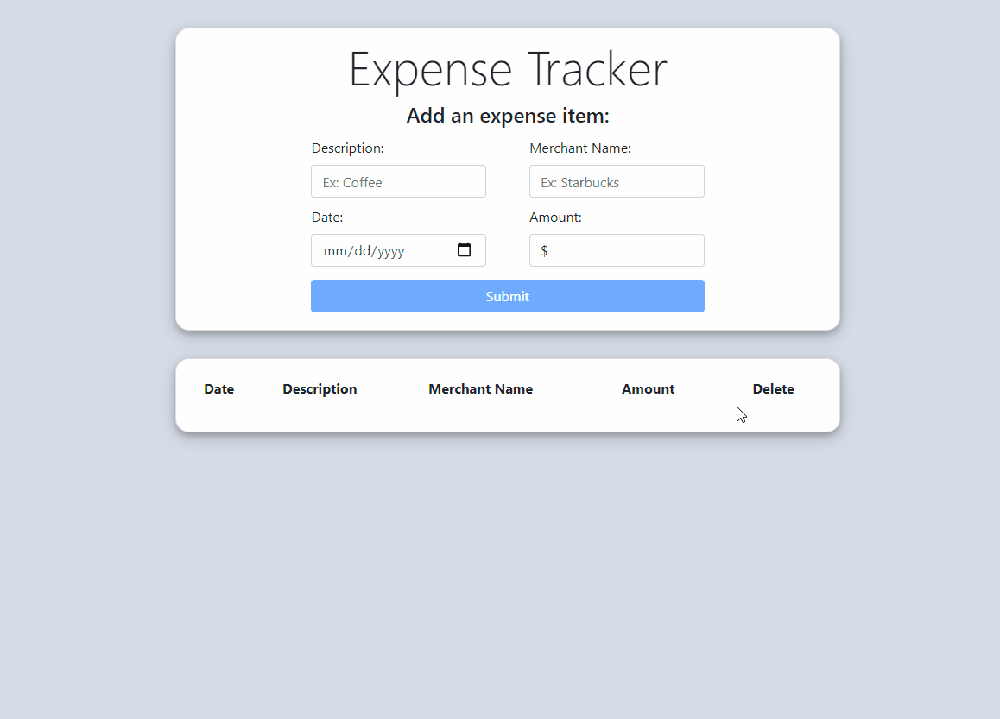

# Expense Tracker App

*This app keeps track of your expenses.*

Try it [here](https://expensetracker-app-herrera.herokuapp.com/)

## Summary

I used React, HTML, and CSS to create a webpage that displays an expense tracker. I leanered how to use bootsrap 4 wih React. I also learned how to utilize state in a React app. This app is deployed using Heroku.

## Author

* **Bryan Herrera** - *Full-Stack Developer* - [Website](http://bryan-herrera.com) | [LinkedIn](https://www.linkedin.com/in/herrerabryan/)  